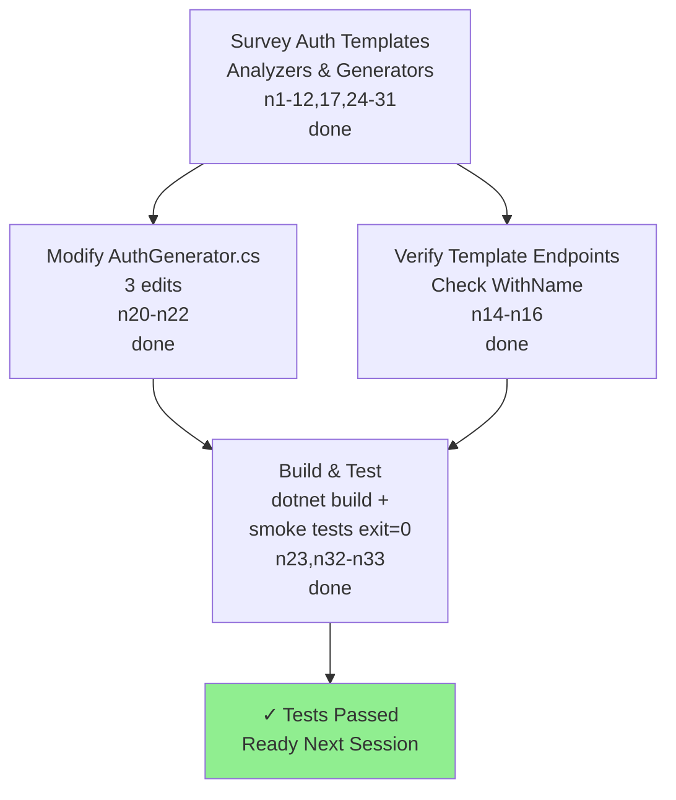

## Current goal and state
Usuário: "termina tudo em ordem, commit e push" — completar os 2 follow-ups da auditoria de auth: (A) round de conformância (fazer `lazuli g auth` voltar a passar no doctor) e (B) o #7 (corrida de rotação). SINGLE SESSION mode ATIVO → fazer tudo você mesmo, SEM call_agent/delegação.
FEITO+PUSHED nesta sessão (branch main, último push 2ef81f7): LZ0012 (commit c6db64a — `.WithName(nameof(X))` nas 16 slices) e LZ0017 (commit 2ef81f7 — AuthGenerator não injeta mais UseAuthentication/UseAuthorization no Program.cs; AuthFlowGenerator move o provider DI pro AccountSetup.AddAccount via novo método AugmentAccountSetup). Verificado: `bash tools/auth-smoke.sh` → LZ0012/LZ0017 zerados, 53/53 testes, sem LZ0022.
UNCOMMITTED mas SEGURO (só templates, não afeta `dotnet build Lazuli.slnx`): Email.cs.cstmpl + PasswordHash.cs.cstmpl marcados `[ValueObject]` (PasswordHash ganhou `public static Result<PasswordHash> From(string)`); AccountErrorCodes.cs.cstmpl ganhou `InvalidState`.

## What changed / important files
Verificador: `tools/auth-smoke.sh` (renderiza auth+email+otp num temp, leg DOCTOR conta findings e afirma no-LZ0022, leg COMPILE+TEST roda os 53 testes gerados; ~40s). Rode após cada grupo de mudança. Doctor restante: 10× LZ0021 + 22 warning LZ0026 (contagens são DOBRADAS pelo build — real = 5 entidades + #7).
Analyzers (forma exigida, já lidos): LZ0014 EntityAnalyzer (sem ctor primário/público; ctor privado sem-args; sem setter público → `{ get; private set; }`; funil privado `EnsureValid()`/`Validate()` retornando `Result<T>`); LZ0013 ValueObjectAnalyzer (sem ctor público/posicional; smart-ctor estático retornando `Result<T>`; sem setter público); LZ0021 UnmarkedDomainType (DbSet<T> → [Entity]; membro complexo de [Entity] → [ValueObject]). Referência canônica de [Entity]: examples/sample-app/.../Wallets/Wallet.cs (factory Open→EnsureValid, RowVersion `[System.ComponentModel.DataAnnotations.Timestamp] byte[]? RowVersion { get; private set; }`).

## Pending work and pitfalls
RESHAPE LZ0021 (templates em src/Lazuli.Cli/Templates/auth*/): 5 entidades DbSet → [Entity] + reescrever slices que as constroem/mutam:
- User.cs.cstmpl: [Entity], setters privados, ctor privado, `static Result<User> Register(Email, PasswordHash, DateTime)` (set Id=Guid.NewGuid(), Name=email.Value), `void ResetPassword(PasswordHash)`, `EnsureValid` (Id presente, Name não-vazio, via InvalidState). OrgId fica `{ get; private set; }` (EF stampa). CUIDADO: campos Phone/IsPhoneVerified/IsEmailVerified são injetados pelos flow generators (AuthFlowGenerator.AugmentUser, FlowSpec.UserFields) — hoje `{ get; set; }`. Precisa: mudar UserFields p/ `{ get; private set; }` E injetar métodos de mutação (email→`MarkEmailVerified()`; otp→`CompletePhoneVerification(string phone)` que seta Phone/IsPhoneVerified/RegistrationStep.Complete; oauth→algo p/ IsEmailVerified+PhonePending). AugmentUser precisa injetar bloco campo+método idempotente.
- UserSession.cs.cstmpl: [Entity] + `[Timestamp] byte[]? RowVersion` (cobre LZ0026 E #7-parte-1) + `static UserSession Start(userId, familyId, tokenHash, now, lifetime)` (Id=Guid.NewGuid()) + `void MarkUsed(DateTime)` + EnsureValid. Usado por Sessions.Issue (oauth), Login.cs (2 variantes cookie), Refresh.cs (rotação + `session.UsedAt = now`→MarkUsed).
- PhoneOtp.cs.cstmpl: [Entity] + `Issue(...)` + `RecordAttempt()` + `Use(now)` + EnsureValid. Slices: ResendPhoneCode (new→Issue), VerifyPhone (otp.Attempts++→RecordAttempt, otp.UsedAt=now→Use).
- EmailVerificationToken.cs.cstmpl: [Entity] + `Issue(...)` + `Consume(now)`. Slices: RequestEmailVerification (new→Issue), VerifyEmail (token.ConsumedAt=now→Consume + user.IsEmailVerified=true→user.MarkEmailVerified()).
- PasswordResetToken.cs.cstmpl: [Entity] + `Issue(...)` + `Use(now)`. Slices: RequestPasswordReset (new→Issue), ResetPassword (token.UsedAt=now→Use + user.PasswordHash=...→user.ResetPassword(...)).
- Register.cs: `new User{...}`→`User.Register(...)` (checar IsFailure). RegisterWithGoogle/LoginWithGoogle/Sessions.cs (oauth, NÃO coberto pelo smoke — verificar manualmente): new User/UserSession → factories.
PITFALL: smoke só renderiza auth+email+otp (NÃO oauth) — mudanças no auth-oauth não são verificadas pelo smoke; revisar à mão.
#7 (spec em docs/specs/auth-refresh-rotation-concurrency.md): no Refresh.cs.cstmpl, após UserSession ter RowVersion — reuso dentro de 10s do UsedAt = retry benigno (não queima família); reuso >10s = burn (atual); catch DbUpdateConcurrencyException→retry benigno. Reescreve o journey [Critical] `Replayed_refresh_token_burns_the_whole_family` (replay imediato vira benigno → avançar relógio >10s p/ provar burn) + teste do caso benigno. Path DbUpdateConcurrencyException só verificável em Postgres (InMemory não enforça) — shipar como [Integration], não roda no smoke.
DEPOIS: rode auth-smoke até LZ0021/LZ0026 zerarem (#7 zera LZ0026 via RowVersion); aperte o smoke (auth-smoke.sh linha ~89) p/ afirmar doctor 100% limpo. Atualize Account.ctx.md (postura de segurança já tem seção). Commit por concern + push. Capture na rede: atualize o item `a2d917e2` (drift — marcar resolvido) e a missão `6d40af8d`. NÃO bumpou versão de lib (tudo CLI/templates) — considere patch bump do lazuli-cli no release.

## Mapa da órbita anterior (memória de curto prazo)

Drill-down (atividade completa por node): C:\Users\lucas\AppData\Roaming\Pleiades\constellation\offload\ae0f1c60-2026-06-15T22-58-43-759625300-00-00.md
